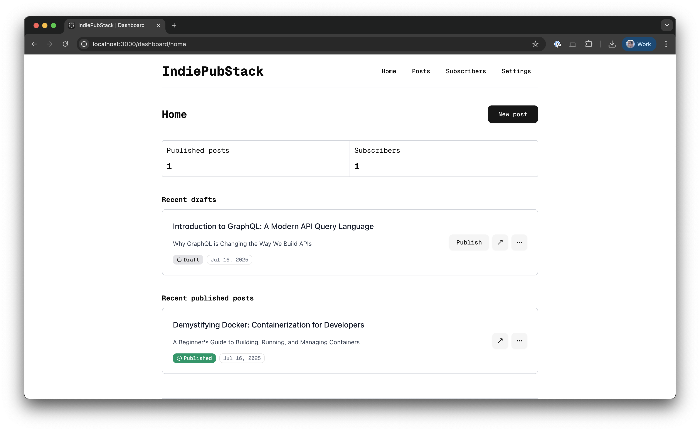

# IndiePubStack

**IndiePubStack** is an open-source, self-hosted publishing platform tailored for **technical creators**. Whether you're a developer looking to blog, send newsletters, or build a paid subscriber base — IndiePubStack gives you the tools to **own your audience** without relying on proprietary platforms.

## ✨ Features

- ✍️ Developer-first blogging experience with Markdown
- 📬 Built-in newsletter delivery
- 💸 Subscription monetization support (coming soon)
- 🔒 Secure authentication via [Kinde](https://kinde.com)
- 📧 Email delivery via [Resend](https://resend.com)
- 🧱 Easily self-host with Docker on any VPS
- 🌐 Full support for custom domains

---

## 🎯 Why IndiePubStack?

Most blogging and newsletter platforms lock you into their ecosystem or charge steep fees. **IndiePubStack** lets you:

- **Own your content and infrastructure**
- **Avoid vendor lock-in**
- **Start free, scale when needed**
- **Customize everything**

## 🛠 Requirements

To self-host IndiePubStack, you'll need:

- ✅ A custom domain
- ✅ [Kinde](https://kinde.com) account (for authentication)
- ✅ [Resend](https://resend.com) account (for email delivery)
- ✅ A VPS or self-hosting provider (e.g. [Hetzner](https://hetzner.com), [DigitalOcean](https://digitalocean.com))
- ✅ A PostgreSQL database
- ✅ [Coolify](https://coolify.io) (optional, for easy deployment)

---

## 🚀 Getting Started

The easiest way to deploy IndiePubStack is using **Docker**. A prebuilt Docker image is available, and deployment can be automated via tools like [Coolify](https://coolify.io).

> **TODO:** Add complete Docker deployment instructions, including Coolify setup.

---

## 📦 Planned Hosting Options

In addition to traditional VPS hosting, we're working on support for **serverless deployments** using platforms like:

- [Vercel](https://vercel.com) + [Neon](https://neon.tech) (PostgreSQL)
- Fly.io, Railway, and others

Stay tuned for updates!

---

## 💡 Free Tier Details

You can get started for free using the generous tiers from our recommended services:

| Service | Free Tier |
|--------|-----------|
| **Kinde** | 10,500 monthly active users [(pricing)](https://kinde.com/pricing) |
| **Resend** | 1,000 contacts/month, unlimited emails [(pricing)](https://resend.com/pricing) |

---

## 🧰 Configuration Guides

Coming soon:

- Setting up authentication with **Kinde**
- Setting up email delivery and webhooks with **Resend**
- Custom domain configuration

> **TODO:** Write step-by-step guides for Kinde + Resend setup and webhooks.

---

## ⚙️ Environment Variables

IndiePubStack uses the following environment variables for configuration:

### Database Configuration
- `DATABASE_URL`: PostgreSQL connection string for the application database

### Kinde Authentication
- `KINDE_CLIENT_ID`: Your Kinde application client ID
- `KINDE_CLIENT_SECRET`: Your Kinde application client secret
- `KINDE_ISSUER_URL`: The issuer URL for your Kinde application
- `KINDE_SITE_URL`: The URL of your IndiePubStack site
- `KINDE_POST_LOGOUT_REDIRECT_URL`: URL to redirect to after logout
- `KINDE_POST_LOGIN_REDIRECT_URL`: URL to redirect to after login

### Resend Email Service
- `RESEND_API_KEY`: Your Resend API key for email delivery
- `RESEND_AUDIENCE_ID`: Audience ID for your Resend account
- `RESEND_DOMAIN`: Domain configured in Resend for sending emails

### Site Configuration
- `DOMAIN`: Your custom domain for the IndiePubStack site
- `PUBLICATION_NAME`: Name of your publication
- `CODE_THEME`: Theme for code blocks in your content

---

## 🤝 Contributing

Contributions are welcome! If you'd like to add features, improve docs, or fix bugs, feel free to open an issue or submit a PR.

---

## 📜 License

MIT License. See [LICENSE](./LICENSE) for more information.

---

## ❤️ Support the Project

If you like IndiePubStack, give it a ⭐ on GitHub and share it with fellow developers!
