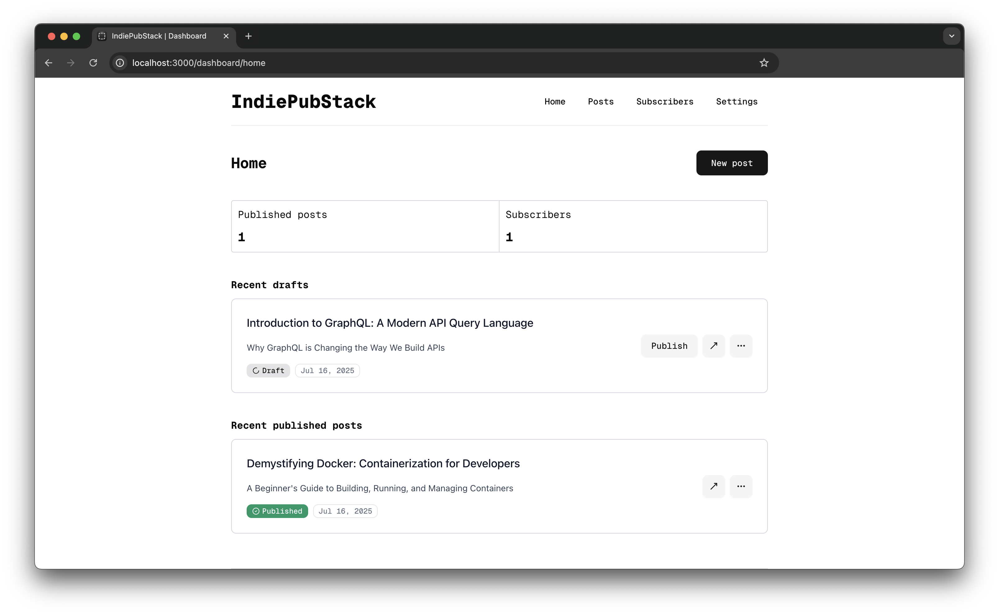

# IndiePubStack

[](https://nextjs.org/)
[](https://react.dev/)
[](https://www.typescriptlang.org/)
[](https://www.postgresql.org/)
[](https://www.docker.com/)
[](LICENSE)

**IndiePubStack** is an open-source, self-hosted publishing platform tailored for **technical creators**. Whether you're a developer looking to blog, send newsletters, or build a paid subscriber base — IndiePubStack gives you the tools to **own your audience** without relying on proprietary platforms.

## 📑 Table of Contents

- [Features](#-features)
- [Why IndiePubStack?](#-why-indiepubstack)
- [Demo](#-demo)
- [Requirements](#-requirements)
- [Technology Stack](#-technology-stack)
- [Getting Started](#-getting-started)
  - [Local Development](#local-development)
  - [Deployment Options](#deployment-options)
    - [Coolify Deployment](#-get-started-with-coolify)
    - [Docker Compose Deployment](#docker-compose-deployment)
- [Configuration](#-environment-variables)
- [Service Setup](#service-setup)
  - [Kinde Setup](#-kinde-setup)
  - [Resend Setup](#-resend-setup)
- [Project Structure](#-project-structure)
- [Troubleshooting](#-troubleshooting)
- [Contributing](#-contributing)
- [License](#-license)
- [Support](#-support-the-project)

## ✨ Features

- ✍️ Developer-first blogging experience with Markdown
- 📬 Built-in newsletter delivery
- 💸 Subscription monetization support (coming soon)
- 🔒 Secure authentication via [Kinde](https://kinde.com)
- 📧 Email delivery via [Resend](https://resend.com)
- 🧱 Easily self-host with Docker on any VPS
- 🌐 Full support for custom domains
- 🚀 Built with modern technologies (Next.js 15, React 19, TypeScript)
- 🔄 Automatic database migrations

## 🎯 Why IndiePubStack?

Most blogging and newsletter platforms lock you into their ecosystem or charge steep fees. **IndiePubStack** lets you:

- **Own your content and infrastructure**
- **Avoid vendor lock-in**
- **Start free, scale when needed**
- **Customize everything**
- **Control your data privacy**

## 🖥 Demo



## 🛠 Requirements

To self-host IndiePubStack, you'll need:

- ✅ A custom domain
- ✅ [Kinde](https://kinde.com) account (for authentication)
- ✅ [Resend](https://resend.com) account (for email delivery)
- ✅ A VPS or self-hosting provider (e.g. [Hetzner](https://hetzner.com), [DigitalOcean](https://digitalocean.com))
- ✅ A PostgreSQL database
- ✅ [Coolify](https://coolify.io) (optional, for easy deployment)
- ✅ Node.js 18+ (for local development)

[//]: # (### Architecture Diagram)

[//]: # ()
[//]: # (![Architecture Diagram]&#40;img/indiepubstackdesign.png&#41;)

## 💻 Technology Stack

IndiePubStack is built with modern, robust technologies:

- **Frontend & Backend**: [Next.js 15](https://nextjs.org/) with [React 19](https://react.dev/)
- **Language**: [TypeScript](https://www.typescriptlang.org/)
- **Database**: [PostgreSQL](https://www.postgresql.org/) with [Drizzle ORM](https://orm.drizzle.team/)
- **Authentication**: [Kinde](https://kinde.com)
- **Email Service**: [Resend](https://resend.com)
- **UI Components**: [Radix UI](https://www.radix-ui.com/) with [Tailwind CSS](https://tailwindcss.com/)
- **Content Rendering**: [Markdown-it](https://github.com/markdown-it/markdown-it) with [Shiki](https://shiki.matsu.io/) for syntax highlighting
- **Containerization**: [Docker](https://www.docker.com/)

## 🚀 Getting Started

### Local Development

To set up IndiePubStack for local development:

1. **Clone the repository**
   ```bash
   git clone https://github.com/yourusername/IndiePubStack.git
   cd IndiePubStack
   ```

2. **Install dependencies**
   ```bash
   npm install
   ```

3. **Set up environment variables**
   ```bash
   cp .env.example .env.local
   ```
   Edit `.env.local` with your configuration (see [Environment Variables](#-environment-variables) section)

4. **Set up a local PostgreSQL database**
   You can use Docker to run a PostgreSQL instance:
   ```bash
   docker run --name indiepubstack-db -e POSTGRES_USER=indie_pub_stack -e POSTGRES_PASSWORD=indie_pub_stack -e POSTGRES_DB=indie_pub_stack_db -p 5432:5432 -d postgres:17-alpine
   ```

5. **Run database migrations**
   ```bash
   npm run db:generate
   ```

6. **Start the development server**
   ```bash
   npm run dev
   ```
   The application will be available at http://localhost:3000

7. **Database management (optional)**
   To view and manage your database with Drizzle Studio:
   ```bash
   npm run db:studio
   ```

### Deployment Options

IndiePubStack can be deployed in several ways:

#### 🚀 Get Started with Coolify

Follow these steps to self-host your own IndiePubStack instance using [Coolify](https://coolify.io):


### 1. 🖥️ Get a VPS

Provision a virtual server from any provider. We recommend [Hetzner](https://www.hetzner.com/cloud) for cost-effective performance.


### 2. 🛠️ Install Coolify

SSH into your server and install Coolify using their official script:

```bash
curl -sSL https://get.coollabs.io/coolify/install.sh | bash
```

Once installed, access the Coolify dashboard via your server’s IP or domain.


### 3. 🐘 Create a PostgreSQL Database

In Coolify:

- Go to **Services → Databases**
- Click **"New Database"**
- Choose **PostgreSQL** (version `17-alpine` is tested and recommended)
- Create the database and note down the connection credentials (host, port, username, password, db name)

---

### 4. 📦 Deploy IndiePubStack

1. Go to **Applications → New Application**
2. Choose **Docker** as the deployment type
3. Use the following Docker image:
   ```
   indiepubstack/indiepubstack:latest
   ```
4. Connect the app to the PostgreSQL database created earlier.


### 5. 🔐 Set Required Environment Variables

In the **Environment Variables** section of your app in Coolify (see more in the Resend and Kinde setup sections)

### 6. 🌐 Set Up a Custom Domain

In Coolify:

1. Go to your app settings
2. Add a **Custom Domain** (e.g. `your.custom.domain`)
3. Update your DNS records to point to your VPS
4. Enable automatic HTTPS (Let’s Encrypt) for secure access

Once everything is deployed and configured, your IndiePubStack instance should be live at your custom domain.

## 📦 Planned Hosting Options

In addition to traditional VPS hosting, we're working on support for **serverless deployments** using platforms like:

- [Vercel](https://vercel.com) + [Neon](https://neon.tech) (PostgreSQL)
- Fly.io, Railway, and others

Stay tuned for updates!

## 💡 Free Tier Details

You can get started for free using the generous tiers from our recommended services:

| Service | Free Tier |
|--------|-----------|
| **Kinde** | 10,500 monthly active users [(pricing)](https://kinde.com/pricing) |
| **Resend** | 1,000 contacts/month, unlimited emails [(pricing)](https://resend.com/pricing) |

---

### 🔐 Kinde Setup

1. **Create a Kinde Account**
    - Sign up at [kinde.com](https://kinde.com) and create a new business.
    - Then, create a new **Backend** application with the **Next.js** framework option.

2. **Set the Callback URL**
    - Use the following callback URL:
      ```
      https://<YOUR_CUSTOM_DOMAIN>/api/auth/kinde_callback
      ```

3. **Retrieve Environment Variables**  
   After setting up the app, you’ll get the following Kinde credentials:
    - `KINDE_CLIENT_ID`
    - `KINDE_CLIENT_SECRET`
    - `KINDE_ISSUER_URL` (this is your Kinde domain)

4. **Set Up a Webhook**  
   To receive user-related events, create a webhook in your Kinde dashboard:
    - **Webhook URL:**
      ```
      https://<YOUR_CUSTOM_DOMAIN>/api/webhooks/kinde
      ```
    - **Subscribed Events:**
        - `user.created`
        - `user.updated`

5. **Configure Environment Variables**  
   Add the following to your `.env` file (for local development or Docker Compose) or set them in your runtime environment:

   ```env
   KINDE_CLIENT_ID=***
   KINDE_CLIENT_SECRET=***
   KINDE_ISSUER_URL=***
   KINDE_SITE_URL=https://<YOUR_CUSTOM_DOMAIN> (or https://localhost:3000)
   KINDE_POST_LOGOUT_REDIRECT_URL=https://<YOUR_CUSTOM_DOMAIN> (or https://localhost:3000)
   KINDE_POST_LOGIN_REDIRECT_URL=https://<YOUR_CUSTOM_DOMAIN> (or https://localhost:3000)
   ```

### 📩 Resend Setup

1. **Create a Resend Account**
    - Sign up at [resend.com](https://resend.com) and generate a new API token.

2. **Set Up a Webhook**
    - Create a webhook with the following URL:
      ```
      https://<YOUR_CUSTOM_DOMAIN>/api/webhooks/resend
      ```
    - **Subscribed Events:**
        - `contact.created`
        - `contact.updated`

3. **Audience Configuration**
    - Free accounts are limited to a single audience, usually named `general`.
    - You can find the **Audience ID** in the Resend dashboard UI.

4. **Set Up a Verified Domain**
    - A **custom domain** is required for sending email broadcasts.
    - You can configure and verify a domain in the Resend dashboard, then use it as `RESEND_DOMAIN`.

5. **Configure Environment Variables**  
   Add the following to your `.env` file (for local development or Docker Compose) or set them in your runtime environment:

   ```env
   RESEND_API_KEY=***
   RESEND_AUDIENCE_ID=***
   RESEND_WEBHOOK_SECRET=***
   RESEND_DOMAIN=yourdomain.com
   ```

## ⚙️ Environment Variables

IndiePubStack uses the following environment variables for configuration:

### Database Configuration
- `DATABASE_URL`: PostgreSQL connection string for the application database

### Kinde Authentication
- `KINDE_CLIENT_ID`: Your Kinde application client ID
- `KINDE_CLIENT_SECRET`: Your Kinde application client secret
- `KINDE_ISSUER_URL`: The issuer URL for your Kinde application
- `KINDE_SITE_URL`: The URL of your IndiePubStack site
- `KINDE_POST_LOGOUT_REDIRECT_URL`: URL to redirect to after logout
- `KINDE_POST_LOGIN_REDIRECT_URL`: URL to redirect to after login

### Resend Email Service
- `RESEND_API_KEY`: Your Resend API key for email delivery
- `RESEND_AUDIENCE_ID`: Audience ID for your Resend account
- `RESEND_DOMAIN`: Domain configured in Resend for sending emails

### Site Configuration
- `DOMAIN`: Your custom domain for the IndiePubStack site
- `PUBLICATION_NAME`: Name of your publication
- `CODE_THEME`: Theme for code blocks in your content

---

## 🤝 Contributing

Contributions are welcome! If you'd like to add features, improve docs, or fix bugs, feel free to open an issue or submit a PR.

---

## 📜 License

MIT License. See [LICENSE](./LICENSE) for more information.

---

## ❤️ Support the Project

If you like IndiePubStack, give it a ⭐ on GitHub and share it with fellow developers!
